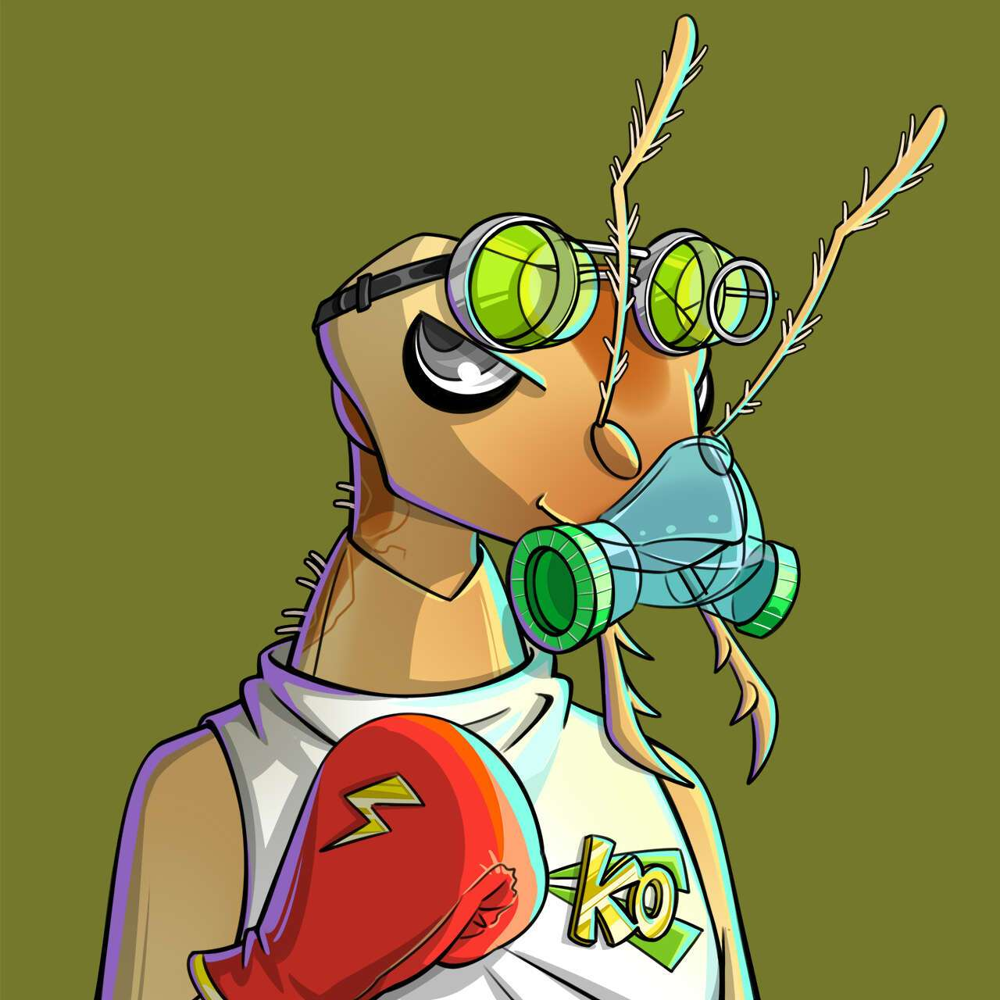

# Aworld

Aworld 是以太坊上第一个生成的手绘 NFT 集合。包含 1,000 个动物物种的特征随机生成到一个“蛋”中。每周都会随机选择鸡蛋，然后由杰出的艺术家设计和手绘。每个 NFT 都是真正的 1/1 且独一无二的。

Aworld 旨在以最高质量的艺术彻底改变个人资料图片空间。

Aworld 是一个 NFT（不可替代代币）集合。存储在区块链上的数字艺术品集合。

总共有 1,932 个 Aworld NFT。目前，407 位车主的钱包中至少有一个 Aworld NTF。

