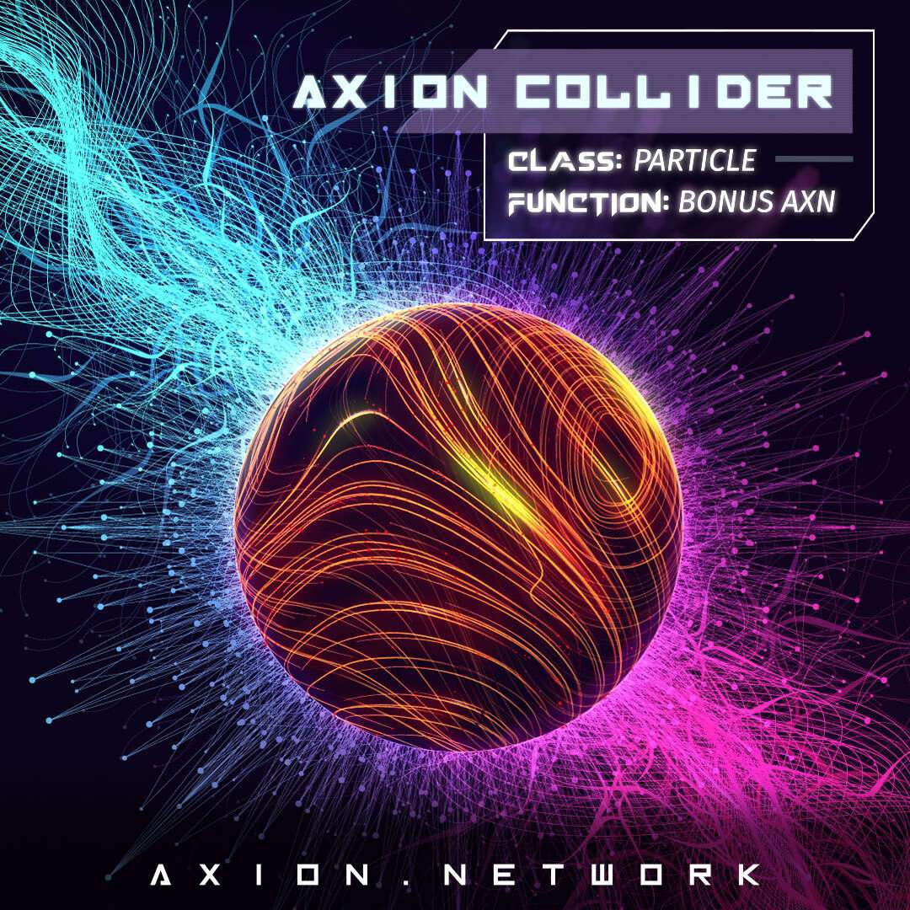

# Axion Collider

有机会将您的 Axion Particles NFT 转换为 Axion Particle Collider 上的实际 AXN 代币！每个 NFT 都包含一定数量的粒子，当参与 Collider 时，这些粒子可以在您设置的持续时间内变成质押的 AXN。他们还将获得比特币红利，如果质押超过 1 年，就可以参与 Axion 的独家 Launchpad！

通过质押 $AXN，除了流动的比特币股息外，您还可以获得 8% 的 APR 利息，从而产生 47% 的潜在回报。

此计算器仅供参考和参考。提供的费率不能保证，并且可以随时更改。使用此计算器不应被视为财务建议。

AXN 代币的价格会波动，从而改变您所持股份的价值。如果 AXN 做 100 倍，您质押的 AXN 加上利息将在到期时价值 100 倍，再加上比特币红利。流动比特币股息可以随时提取。由于全球份额的不断增长，较早的 Staking 比后来的 Staking 带来的收益更高。

