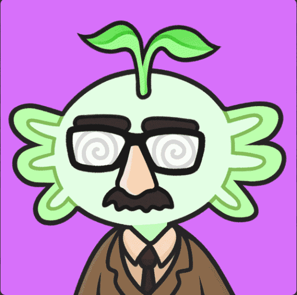

# Axolittles

Axolittles 是 10,000 件由算法生成的艺术品的集合，由 160 多个特征组合而成。他们的灵感来自世界上最可爱的两栖动物蝾螈。每个 Axolittle 都是动画的，并带有一个 48 帧的 GIF，可以完美循环，让你可以盯着它看几个小时！

蝾螈是通往令人惊叹的生态系统的通行证。我们正在创建您想要加入的虚拟世界和数字社区。我们项目的影响并不止于元界。薄荷收益的一部分捐赠给了一个帮助世界各地水净化的慈善机构。

被团队 100% 的母亲投票选为最可爱的*NFT* ……认识蝾螈，这是最早的动画 NFT 项目之一，灵感来自最可爱的动物：蝾螈。我们希望您喜欢这些数字动物，就像我们喜欢创造它们一样。它们很可爱，充满活力，而且是完美的头像。这 10,000 个 Axolittle 中的每一个都是生成的具有 160 多个特征的艺术品，这意味着每个单独的 Axolittle 都是完全独一无二的。

