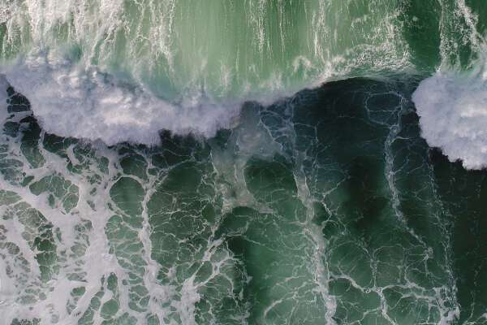

# Ayla Editions

我在加拿大偏远地区迷雾笼罩的山丘上的一个生物动力农场长大。我是个精力充沛的孩子，精力充沛，所以我发现自己经常在外面照料动物、砍柴和清理牧场。正是在那些时刻，我与大自然的爱情开始了。它的一切都给了我灵感、能量和平静。我的父母教我们观星、烹饪、花园等等——但最重要的是，他们教我们进入，让我们内心的孩子走开，始终满足我们的灵感和好奇心。当我父亲向我介绍摄影时，我才能够将脑海中的幻想变为现实。所以，在茫茫荒野，没有社交媒体找模特拍照，我成了自己的缪斯女神，在大自然中，我开始充分意识到我对女性形式的热爱

