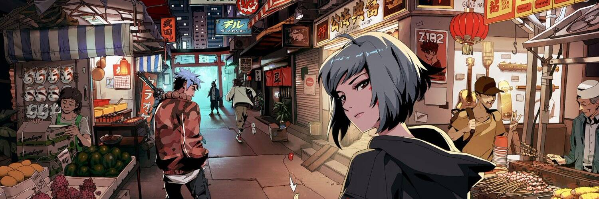

# Azuki1

Azuki 从收集 10,000 个头像开始，让您可以通过会员访问 The Garden：互联网的一个角落，艺术家、建设者和 web3 爱好者在这里聚会，创造一个去中心化的未来。Azuki 持有者可以获得独家掉落、体验等。

▶ 什么是小豆？
Azuki 是 NFT（代代币）集合存储在区块链上的一个不可收藏的收藏品。
▶ 有多少小豆代币？
Azuki N有一个08位10,0个Azuki N。目前5,0个车主的钱包中至少有NTF。
▶ 什么是最昂贵的 Azuki 销售？
最贵的 Azuki NFT 是 Azuki #6168。它于 2022 年 6 月 8 日（3 个月前）以 18.26 万美元的价格售出。
▶最近最多了多少小豆？
过去 30 个用户售出 Azuki 632 个 NFT。
▶ Azuki 的价格是多少？
在过去的一天里，Azuki NFT 31 34 30 30 美元的价格最多，最多超过 0.07 万美元。Azuki NFT 中的价格为 1 万美元。

