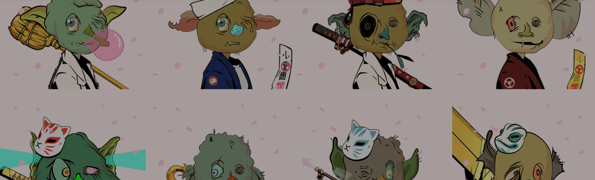

# Azuki Goblin

Aaaaaaaauuuuuggghhhhh 妖精醒来 ou el 发现 azuki el 偷了他们的布丁 dur tam goblintown，看起来很阳光？好的，再见Azuki Goblin NFT - 常见问题（FAQ）过去 7 天内没有出售小豆哥布林。
▶ 什么是小红妖精？
Azuki Goblin 是一个 NFT（非同质代币）集合。存储在区块链上的数字收藏品集合。
▶ 有多少个Azuki Goblin 代币？
53位Azuki Goblin NFT。目前53位车主的钱包中至少有一个Azuki Goblin NFT。
▶最近哥布林有多少个小豆？
过去30个共售出Azuki Goblin NFT 0个。

