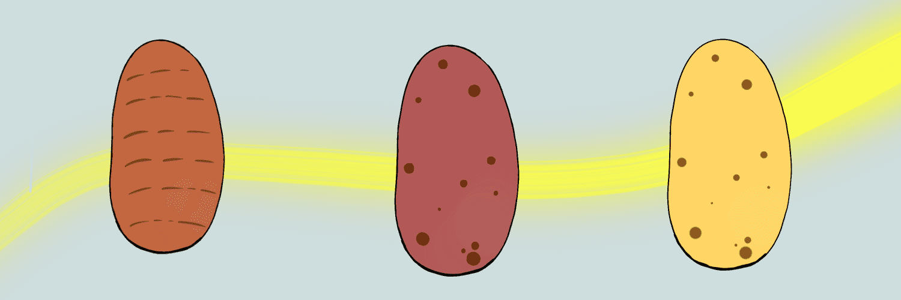

# AzukiPotatoes

有它德根AzukiPotatoes NFT - 问题常见（FAQ）
▶ 什么是小红薯？
AzukiPotatoes 是一个 NFT（非同质代币）集合。存储在区块链上的数字收藏品集合。
▶ 有多少个 AzukiPotatoes 代币？
100个AzukiPotaes NFT。目前65个AzukiPotaes NFT。目前65个AzukiPotaes中至少有一个AzukiPotaes。
▶最近的意义何在？
过去30个AzukiPotato共售出0个。没有路线图没有他妈的 P2E 游戏只有 Azuki 土豆在接下来的 24 小时内将 3 个 azuki 土豆赠送给喜欢并转发此帖子的三位幸运获奖者！

包括这个太空石器

