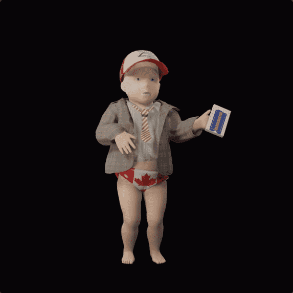

# Babbys

从迪斯科地牢的深处，他来了。是贝比！他*喜欢*跳舞。

世界在燃烧。
你为什么不把我抱得更近一点？
永恒的雕塑。

▶ 什么是婴儿？
Babbys 是一个 NFT（非同质代币）集合。存储在区块链上的数字艺术品集合。
▶ 有多少 Babbys 代币？
总共有 6,666 个 Babbys NFT。目前，1,368 位车主的钱包中至少有一个 Babbys NTF。
▶ 什么是最昂贵的 Babbys 销售？
出售的最昂贵的 Babbys NFT 是 Babby #824。它于 2022 年 6 月 8 日（3 个月前）以 545.6 美元的价格售出。
▶ 最近卖了多少Babbys？
过去 30 天内售出了 158 个 Babbys NFT。
▶ Babbys 的价格是多少？
在过去 30 天里，Babbys NFT 最便宜的销售额低于 33 美元，最高销售额超过 99 美元。过去 30 天，Babbys NFT 的中位价格为 65 美元。
▶ 什么是流行的 Babbys 替代品？
许多拥有 Babbys NFT 的用户还拥有 CryptoDickbutts、 Galerie Yeche Lange Pie Key Un、 Shields和 CryptoTitVags。

