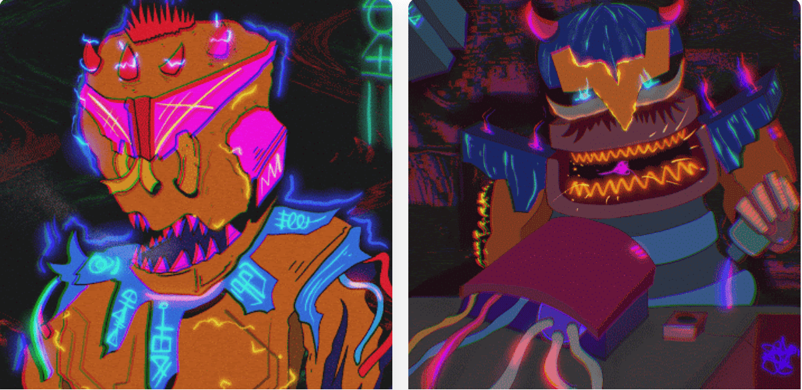

# BABLA STUFF ED.

monsta m，炽热的火焰，勇敢的风格怪物的象征，快速移动BABLA STUFF ED。NFT - 常见问题（FAQ）
▶ 什么是 BABLA STUFF ED.？
BABLA STUFF ED。是一个 NFT（替代币）集合存储。不可在区块链上的数字收藏品集合。
▶ 多少BABLA STUFF ED。代币存在吗？
ED中有5个BABLA S。8个BABLA STUFF。目前，他们至少拥有一个BABLA S ED。NTF在其中。
▶ 什么是最贵的 BABLA STUFF ED。
最昂贵的 BABLA STUFF ED。于销售的 NFT 是艺术生成器代币。它 2022-06-17（2 个月前）以 282 美元的价格售出。
▶ 多少 BABLA STUFF ED。最近有卖吗？
有 14 个 B 过去 LA 出的 NFT。
▶ BABLA STUFF ED 成本。
过去 20 年 2 月 3 日 3 月 76 日，BABLA 过去 3 年 7 月 7 日。 NFT 4 月 20 日的价格为 4 美元。
▶ 什么是流行的 BABLA STUFF ED。备择方案？
拥有 BABLA STUFFED 的用户。NFT 还拥有 LICENSE TO SHILL、GLITTCHH MEE EVERYDAY、De'Queenera 和 OXO JOURNEY。

