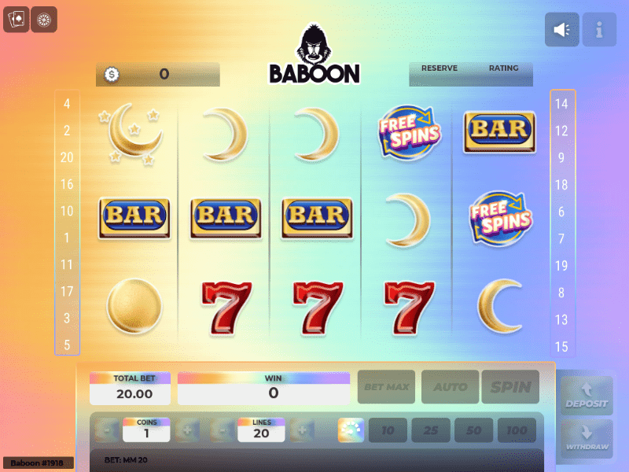

# BaboonBet

获得在 Monkey Money 上运行的您自己的 NFT。
▶ 什么是狒狒赌？
BaboonBet 是一个 NFT（非同质代币）集合。存储在区块链上的数字艺术品集合。
▶ 有多少 BaboonBet 代币？
总共有 10,000 个 BaboonBet NFT。目前，2,440 名所有者的钱包中至少有一个 BaboonBet NTF。
▶ 什么是最昂贵的 BaboonBet 销售？
出售的最昂贵的 BaboonBet NFT 是 Baboon #6672。它于 2022-06-16（3 个月前）以 273.8 美元的价格售出。
▶ 最近卖出了多少 BaboonBet？
过去 30 天内售出了 77 个 BaboonBet NFT。
▶ BaboonBet 的费用是多少？
在过去 30 天里，最便宜的 BaboonBet NFT 销售额低于 0 美元，最高销售额超过 62 美元。BaboonBet NFT 的中位价格在过去 30 天内为 0 美元。
▶ 什么是流行的 BaboonBet 替代品？
许多拥有 BaboonBet NFT 的用户还拥有 Moon Kongz Test、 CLAYPETS、 Pictograph Stomach Ache和 Degenerate Dinos。

