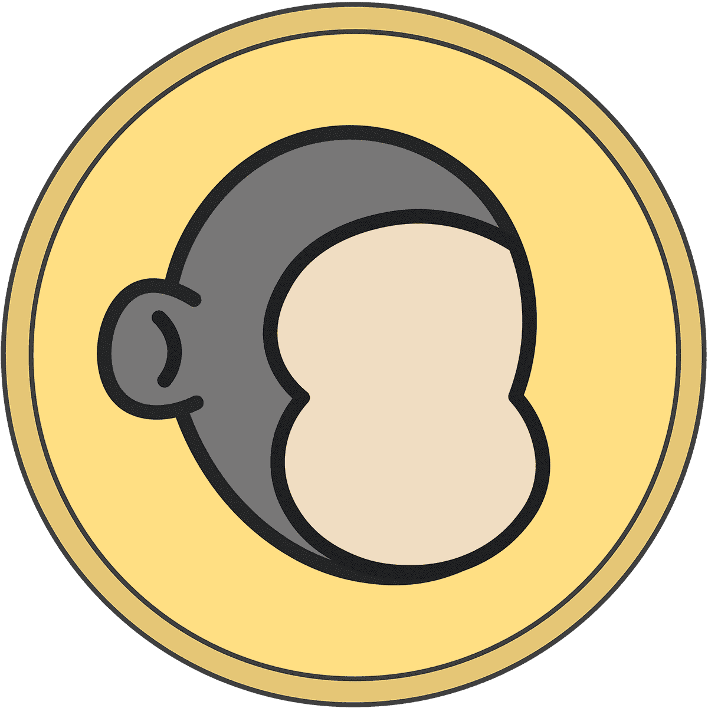

# Baby Ape Doodles

Baby Ape Doodles 统计数据   创建于 4 个月前  100 代币供应  5% 费用
过去 7 天没有售出婴儿猿涂鸦。

2000 幅小猿猴涂鸦。

Baby Ape Doodles NFT - 常见问题（FAQ）
▶ 什么是猿宝宝涂鸦？
Baby Ape Doodles 是一个 NFT（非同质代币）系列。存储在区块链上的数字艺术品集合。
▶ 有多少 Baby Ape Doodles 代币？
总共有 100 个 Baby Ape Doodles NFT。目前 5 位所有者的钱包中至少有一张 Baby Ape Doodles NTF。
▶ 最近卖出了多少只猿宝宝涂鸦？
过去 30 天内售出 0 个 Baby Ape Doodles NFT。

