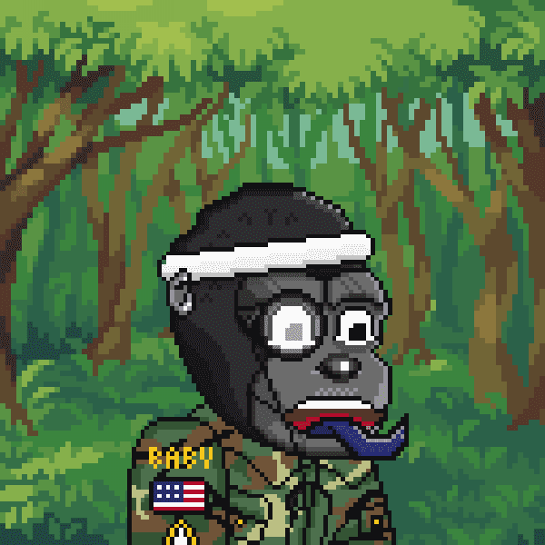

# Baby CyberGorillas

一个由 3333 名 CyberGorillas 组成的部落在丛林中秘密工作，以开发强大的 JungeSerum。食用后，将生产一个 Baby CyberGorilla。我们 P2E 生态系统的一部分。

当您的 NFT 被质押在智能合约中时，它们可能会积累一个实用代币（“CYBER”）。除了 Cyber Gorillas 生态系统之外，CYBER 没有其他功能，并且不能从 Cyber Gorillas Developers 购买。Cyber Gorillas 开发人员不提供也不打算为 CYBER 提供二级市场。▶ 什么是 Baby CyberGorillas V2？
Baby CyberGorillas V2 是一个 NFT（Non-fungible token）集合。存储在区块链上的数字收藏品集合。
▶ 有多少 Baby CyberGorillas V2 代币？
一个Gorillas V或N个婴儿NT 1,68 Baby Cyberillas V2。目前，18个车主的钱包中至少有一个GorillaF。
▶ Baby CyberGorillas V2 最贵的促销是什么？
出卖最贵的 Baby CyberGorillas V2 NFT 婴儿 Baby CyberGorilla #1215。它是在 2022-06-10（3 个月前）以 88.6 美元的价格售出。

