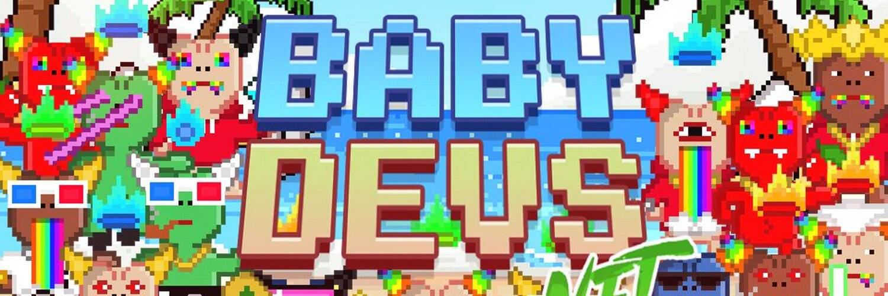

# Baby Devs NFT (OFFICIAL)

Baby Devs NFT 是在以太坊区块链上狂奔的 6,666 名 Baby Devs 的集合，将所有销售利润的 15% 捐赠给专注于消除儿童饥饿的儿童慈善机构 No Kid Hungry。Baby Devs NFT 致力于慈善、社区和公用事业，将通过推出 $HEAVEN 硬币并将空投和质押奖励给持有者，将利润重新投资回生态系统。Baby Devs NFT NFT - 常见问题（FAQ）
▶ 什么是 Baby Devs NFT？
Baby Devs NFT 是一个 NFT（Non-fungible token）存储集合。在区块链上的数字收藏品集合。
▶ 有多少 Baby Devs NFT 代币？
540个婴儿开发一个NFT中至少有一个NT。
▶ 最昂贵的 Baby Devs NFT 销售是什么？
出售的最贵的 Baby Devs NFT NFT 是 Baby Dev #6322。它于 2022-06-07（3 个月前）以 5.1 美元的价格售出。
