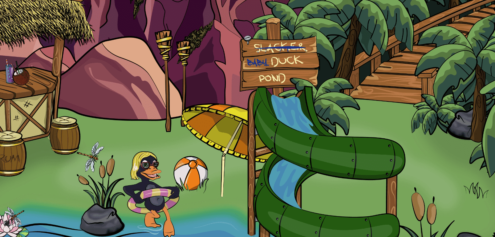

# Baby Duck Incubator

Baby Duck Pond NFT - 常见问题（FAQ）
▶ 什么是小鸭池？
Baby Duck Pond 是一个 NFT（Non-fungible token）集合存储。在区块链上的数字收藏品集合。
▶ 有多少小鸭池代币？
一个DF有7个DF和2,53个Baby Duck Po。目前，业主的钱包中至少有一个NFT。
▶最近卖了几只小鸭池？
过去 30 件 Duck Pond 出售 2 个 Baby NFT。每只小鸭子都是独一无二的，并通过 100 多种可能的资产（例如表情、服装等）以编程方式生成。
所有的鸭子都是毒品，但有些鸭子比其他鸭子更稀有。

鸭子作为 ERC-721 代币存储在以太坊区块链上。
已验证的智能合约地址

