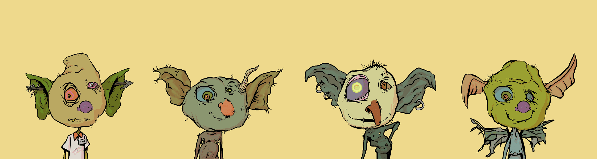

# Baby goblinr

啊啊啊啊啊啊啊啊啊啊啊啊啊啊啊啊啊啊啊啊啊啊啊啊啊啊啊啊啊啊啊啊啊啊啊啊啊啊啊啊啊啊啊啊啊啊啊啊啊啊啊啊啊啊啊啊啊啊啊啊啊啊啊啊啊啊啊啊啊啊啊啊啊啊啊啊啊啊啊啊啊啊啊啊啊啊啊啊啊啊啊啊啊啊啊啊啊啊啊啊啊啊啊啊啊啊啊啊啊啊啊啊啊啊啊啊啊啊啊啊啊啊啊啊啊啊啊啊啊啊啊啊啊啊啊啊啊啊啊啊啊啊啊啊啊啊啊啊啊啊啊啊啊啊啊啊啊啊啊啊啊啊啊啊啊啊啊啊啊啊啊小妖精小妖精是NFT（非同质代币）集合。存储在一条链上的数字收藏品集合。
▶ 有多少个小地精代币？
目前，2,42位小车主的钱包中至少有一个NTF。
▶ 什么是最昂贵的婴儿地精特卖？
出卖的最贵的小地精NFT是小地精#4291。它于2022-06-04（3个月前）以309.6美元的价格售出。

