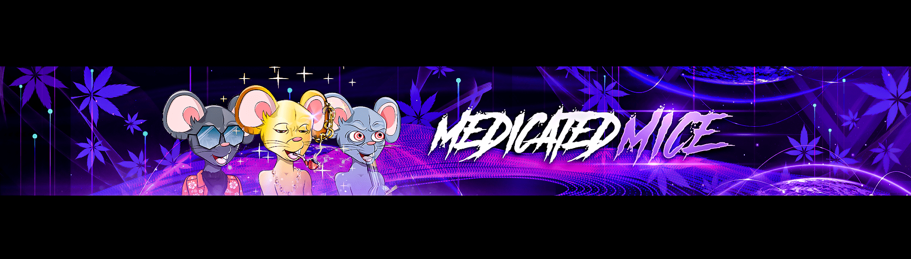

# Baby Medicated Mice

由于 staking，持有人数量不准确。我们的第 2 代小老鼠系列由 1,420 个独特的算法生成的 NFT 组成。这些婴儿具有每天高达 200 倍 $DISPO 的利润丰厚的质押能力！我们将大麻药房带到 Metaverse。我们在 Snoop D.O.G.G 旁边的 Sandbox 中拥有 LAND (10, -88)！这是我们构建第一个虚拟药房的地方。▶ 什么是婴儿药鼠？
Baby Medicated Mice 是一个 NFT（不可替代代币系列）。存储在区块链上的数字收藏品集合。
▶宝宝有多少种药鼠代币？
目前，14位主人的钱包里至少有一个婴儿NTF。
▶ 什么是最昂贵的婴儿鼠药销售？
最贵的 Baby Medicated Mice NFT Legendary Baby Medicated Mice #238。它是于 2022 年 6 月 20 日（2 个月前）以 97.7 美元的价格售出。

