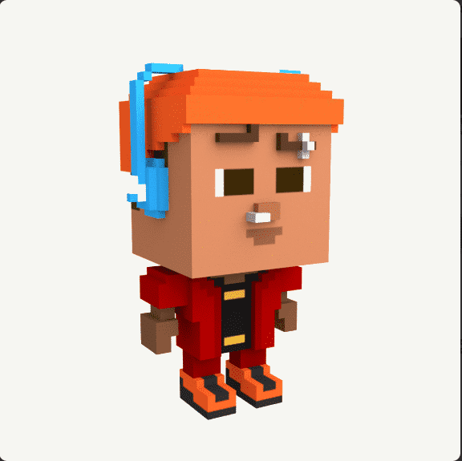

# BabyBoomerNFT

BabyBoomer 项目是一个与奖励游戏配对的NFT 生态系统。购买、出售、交易和玩可解锁的 NFT 角色并获得真正的奖励。一个简单的概念：解锁 NFT，玩游戏并获得报酬。

每个 NFT 本身都是一个算法生成的随机 3D 交互角色，其所有权证明存储在区块链上。每个可爱的角色都准备好在 Opensea 市场上收集、炫耀、出售和交易。

没有两个 BabyBoomer NFT 是相同的，这意味着所有 2500 都是完全独特和个性化的。婴儿潮一代 NFT 只能从一个神秘盒子中揭开。

