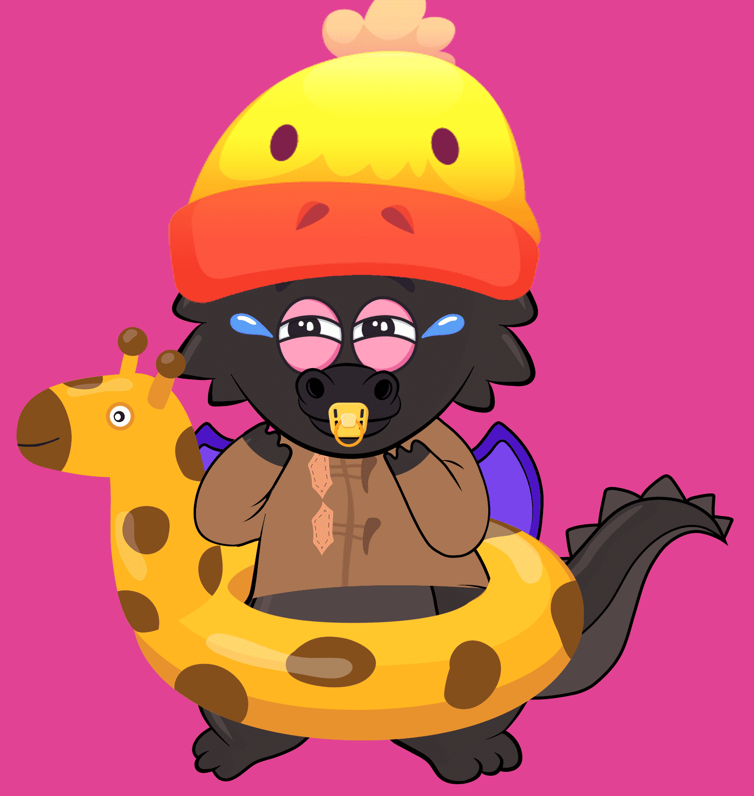

# BabyDragon Club

龙宝宝出生在元宇宙中一个不知名的小岛上，传说它们虽然很小，却非常强大。

BabyDragon 是 NFT 系列 10000 个独特的 BabyDragon 定制婴儿系列正在加入 Opensea 上的 NFT 空间。

▶ 什么是龙宝宝俱乐部？
BabyDragon Club 是一个 NFT（非同质代币）集合。存储在区块链上的数字艺术品集合。
▶ 龙宝宝俱乐部代币有多少？
总共有 10,000 个 BabyDragon Club NFT。目前有 25 位车主的钱包里至少有一个 BabyDragon Club NTF。
▶ 最近卖了多少龙宝宝俱乐部？
过去 30 天内售出 0 个 BabyDragon Club NFT。

