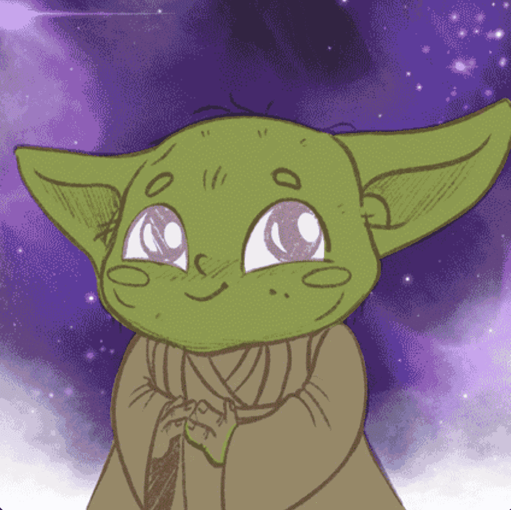

# Babystarlords

7777 位星际领主宝宝穿越银河，抵达以太坊区块链以拯救人类。

这是收藏之前几乎从未做过的。这些数字密钥中的每一个都是为了测试 NBD 集体构建的流程，这是 NBD 团队的第一个。NBD 团队是一群开发人员、艺术家、故事讲述者和社区建设者，他们希望为艺术品所有者提供新功能集。

Babystarlords NFT - 常见问题（FAQ）
▶ 什么是 Babystarlords？
Babystarlords 是一个 NFT（不可替代代币）系列。存储在区块链上的数字艺术品集合。
▶ 存在多少 Babystarlords 代币？
总共有 2,376 个 Babystarlords NFT。目前，600 位车主的钱包中至少有一个 Babystarlords NTF。
▶ 最近卖出了多少 Babystarlords？
过去 30 天内共售出 0 个 Babystarlords NFT。

