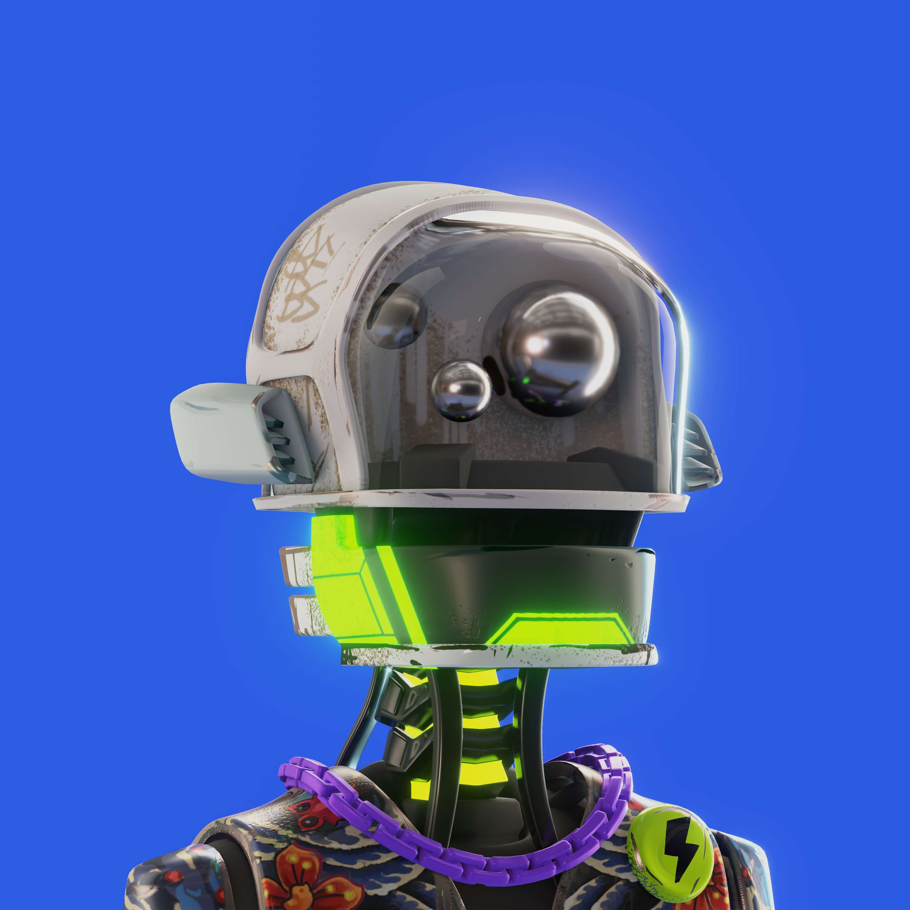

# Bad Face Bots

以太坊区块链上的 5555 个坏脸机器人。

一个探索机器人团队 Bad Face Bots (BFBS) 抵达后世界末日的地球，却发现它被人类在逃离地球时留下的垃圾所覆盖。被这些被遗忘的物体所吸引，我们的坏脸机器人通过将这些机制改变为它们自己的解剖结构，找到了使用这些碎片的创造性方法。他们以自己古怪的风格模仿人类的方式，适应这个垃圾星球上的新生活方式。密切关注我们的 Bad Face Bots，因为它们导航并适应我们人类留下的世界。

我们的 BFBS 由 11 个类别的 300 多个特征生成，例如：头部、核心、眼睛、耳朵、身体装饰等，产生超过 100 万亿种不同的组合。我们广泛的特性使我们的 BFBS 具有不同程度的稀有性，但请放心，我们所有的 BFBS 本身就具有价值。

