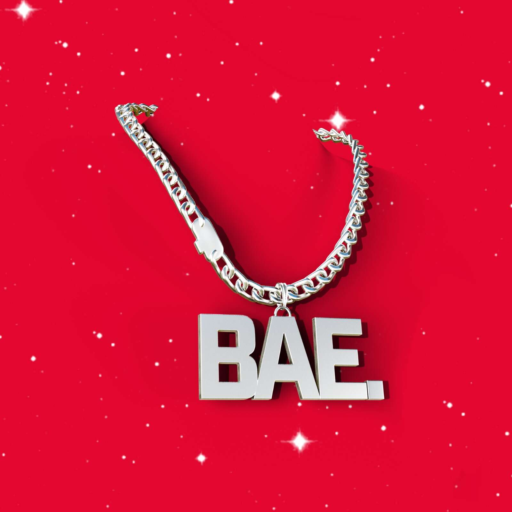

# bae lockit

裴。lock.it 是 bae 的独家早期访问通行证。nfts，每个 bae。lockit 持有人将空投 1 bae。每个 lock.it 的 nft。|| 裴。nfts 将于 2022 年 7 月 15 日铸造。立即获取您的 lock.it，查看我们的网站了解更多详细信息。

▶ 什么是 bae。锁定它？
裴。lock.it 是一个 NFT（不可替代代币）集合。存储在区块链上的数字艺术品集合。
▶ 多少 bae。lock.it 令牌存在吗？
总共有331个bae。lock.it NFT。目前有 171 位业主拥有至少一个 bae。lock.it NTF 在他们的钱包里。
▶ 什么是最贵的宝贝。lock.it 出售？
最贵的宝贝。lock.it NFT 出售的是 bae lockeit #327。它于 2022 年 6 月 26 日（2 个月前）以 2.1 美元的价格出售。
▶ 多少 bae。lock.it 最近卖了？
有1个bae。过去 30 天内售出的 lock.it NFT。

