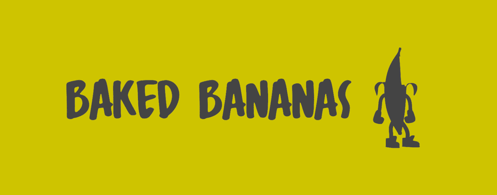

# Baked Bananas NFT

Baked Bananas NFT NFT 在过去 7 天内售出 1 次。Baked Bananas NFT 的总销售额为 21.96 美元。一份烤香蕉 NFT NFT 的平均价格为 22 美元。Baked Bananas NFT 拥有者有 347 名，总供应量为 420 个代币。

全国香蕉日和420在同一天？精美的。我们非常喜欢 🍌 + 🚬 我们决定为 NFT 社区制作一份礼物，新鲜出炉的 Forsaken Labs 午餐烤箱♥

这些烤香蕉将来会有隐藏的用途。如果你错过了，别担心！我们将在未来举办更多有趣的活动！

最大供应量当然是 420。每个钱包一个免费薄荷糖。享受吧，猩猩们！

烤香蕉 NFT NFT - 常见问题（FAQ）
▶ 什么是烤香蕉 NFT？
Baked Bananas NFT 是一个 NFT（Non-fungible token）集合。存储在区块链上的数字艺术品集合。
▶ 烤香蕉 NFT 代币有多少？
总共有 420 个烤香蕉 NFT NFT。目前，347 位所有者的钱包中至少有一个 Baked Bananas NFT NTF。
▶ 最昂贵的烤香蕉 NFT 销售是什么？
出售的最昂贵的烤香蕉 NFT NFT 是 . 它于 2022-06-19（2 个月前）以 22 美元的价格售出。
▶ 最近卖出了多少烤香蕉 NFT？
过去 30 天内售出了 6 个烤香蕉 NFT NFT。
▶ 流行的烤香蕉 NFT 替代品有哪些？
许多拥有 Baked Bananas NFT NFT 的用户还拥有 Pixel Kevin NFT、 Not Okay NFT、 Doji x Ethereum和 Winged Turtles。

