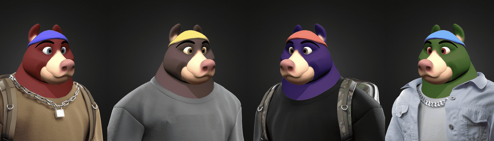

# Baller Bear Billionaire Club

在这个限量版系列中，高级时装街头服饰与元宇宙相遇，仅 200 只 Baller Bears 摇摆着最热门的炒作服装。拥有 Baller Bear 可以让您对 Bear 的 IP 拥有独家所有权，您可以根据自己的选择从中获利。您可以与其他所有者合作，为全世界创造 Baller Bear 媒体体验，使用您的 Bear NFT 作为您在 Metaverse 中的身份，或在 OpenSea 和 Rarible 等市场上转售您的 NFT。您的所有权受区块链保护，任何人都不能更改、修改或删除您的 Baller Bear NFT。你有它的生活......除非你卖掉它。

Baller Bear Billionaire Club NFT - 常见问题（FAQ）
▶ 什么是 Baller Bear 亿万富翁俱乐部？
Baller Bear Billionaire Club 是一个 NFT（非同质代币）系列。存储在区块链上的数字艺术品集合。
▶ 有多少 Baller Bear Billionaire Club 代币？
总共有 201 个 Baller Bear Billionaire Club NFT。目前，153 位业主的钱包中至少有一个 Baller Bear Billionaire Club NTF。
▶ 最近卖出了多少 Baller Bear Billionaire Club？
过去 30 天内共售出 0 个 Baller Bear Billionaire Club NFT。

