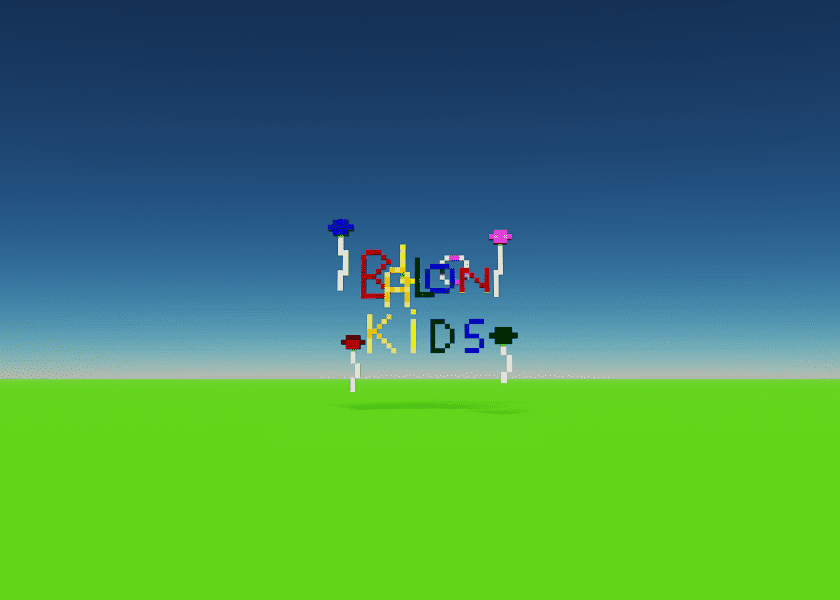

# Balloon Kids Customs

Special Delivery Balloon 的 HODLR 可以要求 Ruby da Great 定制设计的 Balloon Kid。

定制设计的范围从 0.007 到 0.015 ETH 多边形，具体取决于设计中要求的特征数量。

Ruby 才 9 岁，请耐心等待您的请求。我们的目标是让您的设计在 72 小时内周转。

Balloon Kids Customs NFT - 常见问题（FAQ）
▶ 什么是气球儿童风俗？
Balloon Kids Customs 是一个 NFT（不可替代代币）系列。存储在区块链上的数字艺术品集合。
▶ 有多少 Balloon Kids Customs 代币？
总共有 507 个 Balloon Kids Customs NFT。目前，485 位车主的钱包中至少有一个 Balloon Kids Customs NTF。
▶ 最近卖出了多少个气球童装？
过去 30 天内共售出 0 个 Balloon Kids Customs NFT。

