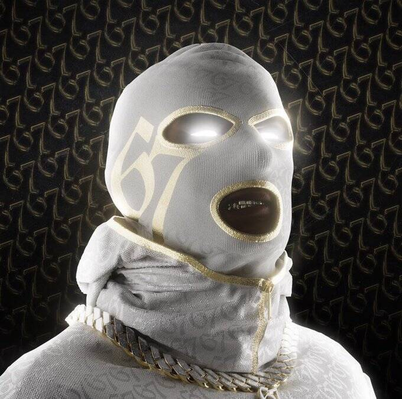

# Bally Gang OfficiaI

Bally Gang NFT 是 8,888 个 NFT 的集合，包含现实生活和虚拟实用程序。在具有 300 多个 3D 特征的以太坊区块链上推出，每个 NFT 都是独一无二的。Bally Gang NFT 持有者是一个独家社区的一部分，该社区充满了对娱乐、商业和 nft 爱好者感兴趣的志同道合的人，他们相信加密货币和区块链技术的未来。

Bally Gang NFT - 常见问题 (FAQ)
▶ 什么是 Bally Gang？
Bally Gang 是一个 NFT（不可替代代币）系列。存储在区块链上的数字艺术品集合。
▶ 有多少 Bally Gang 代币？
总共有 6,768 个 Bally Gang NFT。目前，1,026 位车主的钱包中至少有一个 Bally Gang NTF。
▶ 最昂贵的 Bally Gang 销售是什么？
出售的最昂贵的 Bally Gang NFT 是 Bally Gang（未公开）。它于 2022 年 6 月 8 日（3 个月前）以 380.6 美元的价格售出。
▶ 最近卖出了多少 Bally Gang？
过去 30 天内售出了 72 个 Bally Gang NFT。
▶ Bally Gang 的费用是多少？
在过去 30 天里，最便宜的 Bally Gang NFT 销售额低于 58 美元，最高销售额超过 335 美元。过去 30 天内，Bally Gang NFT 的中位价格为 220 美元。
▶ 流行的 Bally Gang 替代品有哪些？
许多拥有 Bally Gang NFT 的用户还拥有 Trillionaire Thugs、 666 SKELETONS、 Kiwi's n Kangaroo's和 Hijabi Queens。

