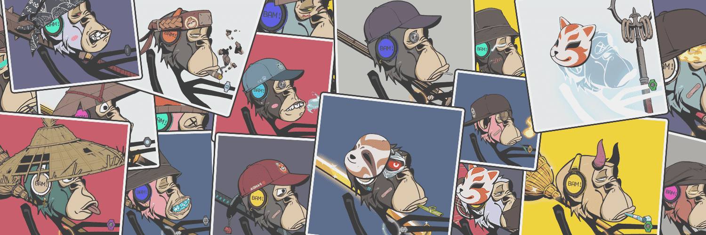

# BAM NFT

无聊猿游艇俱乐部 x Azuki x mfer

只做degen的东西  3333 立即造币！

该系列基于以太坊区块链，包括 3,333 个 Bored Azuki mfers，具有 201 个特征。

我们是 BAM！
没有官方不和。没有路线图。没有剧情。只是产生共鸣！正如 Sartoshi 所说，“没有国王、统治者或明确的路线图，mfer 可以用这些 mfer 构建他们能想到的任何东西”。

BAM NFT NFT - 常见问题（FAQ）
▶ 什么是 BAM NFT？
BAM NFT 是一个 NFT（Non-fungible token）集合。存储在区块链上的数字艺术品集合。
▶ 有多少个 BAM NFT 代币？
总共有 378 个 BAM NFT NFT。目前 29 位所有者的钱包中至少有一个 BAM NFT NTF。
▶ 最近卖出了多少 BAM NFT？
过去 30 天内售出 0 个 BAM NFT NFT。

