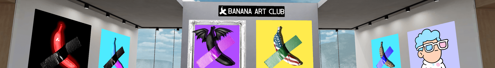

# Banana Art Club Main

限量 300 件系列！

持有香蕉 NFT 即可为即将推出的新系列免费提供 NFT！

价值 120000 美元的香蕉即将来到元宇宙！

▶ 什么是香蕉艺术俱乐部主线？
Banana Art Club Main 是一个 NFT（非同质代币）系列。存储在区块链上的数字艺术品集合。
▶ Banana Art Club 主要代币有多少？
总共有 300 个香蕉艺术俱乐部主 NFT。目前 116 位业主的钱包中至少有一个 Banana Art Club Main NTF。
▶ Banana Art Club Main Sale 最贵的是什么？
最昂贵的 Banana Art Club Main NFT 是 Banana Art Club #38。它于 2022 年 6 月 22 日（2 个月前）以 32.9 美元的价格售出。
▶ Banana Art Club Main 最近卖出了多少？
过去 30 天内共售出 4 个 Banana Art Club 主 NFT。
▶ 流行的香蕉艺术俱乐部主要替代品有哪些？
许多拥有 Banana Art Club Main NFT 的用户还拥有 Waifu Harem Club NFT、 Inferno Genesis Keys、 EllioTrades NFT Collection和 Boss Babes Genesis Collection。

