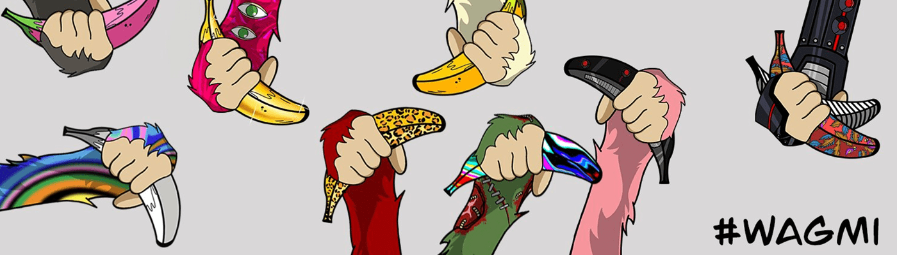

# Banana Hands

手正是顾名思义 - 10,888 只猿手的集合，经过精心手工制作以匹配风格和属性，BAYC Apes 彻底改变并激发了以太坊区块链上 NFT 收藏品的增长和采用！手是对 BAYC 以及所有 NFT 创作者和收藏家的颂歌！手是对 NFT 给艺术家带来的真正自由创造力的认可和欣赏！手是一个提醒，NFT 将继续存在！手是在这个空间中经过验证且不断增长的信念的象征，即“我们都会成功”（#WAGMI）！

