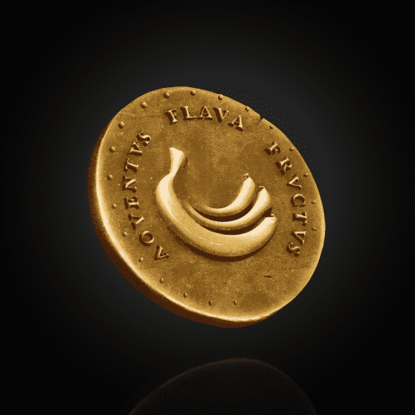

# Banana Fund

香蕉基金/养老基金是我们感谢和回馈猩猩爷爷的方式。Grandpa Ape 代币是一种 NFT 代币，每月赠送给每个 Grandpa Ape 的钱包。这些代币将用于解锁不同级别的独家 NFT 内容，这些内容也可以出售和交易。此外，它们也可以被爷爷猿养老基金买回或与其他猿爷爷一起出售。代币只会赠送给 ORIGINAL GRANDPA APES。

Banana Fund NFT - 常见问题（FAQ）
▶ 什么是香蕉基金？
Banana Fund 是一个 NFT（不可替代代币）集合。存储在区块链上的数字艺术品集合。
▶ Banana Fund 代币有多少？
总共有 1 个 Banana Fund NFT。目前，1,787 位所有者的钱包中至少有一个 Banana Fund NTF。
▶ 最昂贵的香蕉基金销售是什么？
Banana Fund NFT 出售的最昂贵的是 Grandpa Ape Token。它于 2022 年 6 月 20 日（2 个月前）以 0.7 美元的价格出售。
▶ 最近卖出了多少只香蕉基金？
过去 30 天内售出 1 个 Banana Fund NFT。
▶ 什么是流行的香蕉基金替代品？
许多拥有 Banana Fund NFT 的用户还拥有 GrandpaApes、 0xGREEN、 Grandpa Apes Genesis和 ZombieZ。

