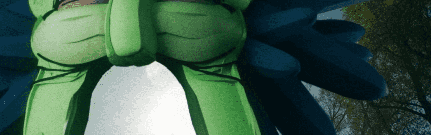

# bananakin bunches

香蕉金在他自己的智能合约上的一系列版本。

香蕉金串 NFT - 常见问题（FAQ）
▶ 什么是香蕉串？
香蕉金串是一个 NFT（非同质代币）集合。存储在区块链上的数字艺术品集合。
▶ 有多少香蕉束代币？
总共有 10 个香蕉串 NFT。目前，41 位车主的钱包里至少有一束 NTF 香蕉。
▶ 最昂贵的香蕉束销售是什么？
NFT 出售的最昂贵的香蕉束是 Herd Thinner。它于 2022 年 6 月 8 日（3 个月前）以 91 美元的价格售出。
▶ 最近卖了多少串香蕉？
过去 30 天内售出了 4 个香蕉串 NFT。
▶ 流行的香蕉束替代品有哪些？
许多拥有香蕉串 NFT 的用户还拥有 Random Doomscrolls、 DGS - Glitch 系列。, Kotegawa 的 WABI-SABI和 一个吸引人的可怕事物的集合。

