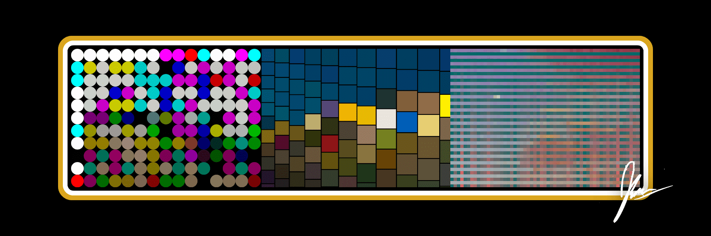

# Banned NFT

BANNED 是一个生成艺术 NFT 项目，由 @JakeTheDegen、@iJmillz 和 @ChipWalkerNFT 的独特摄影作品播种。这是一个宣言，社区和伟大源于一个人在逆境中所做的事情。

禁止 NFT NFT - 常见问题 (FAQ)
▶ 什么是禁止的 NFT？
Banned NFT 是一个 NFT（不可替代的代币）集合。存储在区块链上的数字艺术品集合。
▶ 有多少被禁止的 NFT 代币？
总共有 419 个被禁止的 NFT NFT。目前 239 位所有者的钱包中至少有一个 Banned NFT NTF。
▶ 最近卖出了多少 Banned NFT？
过去 30 天内售出 0 个被禁止的 NFT NFT。

