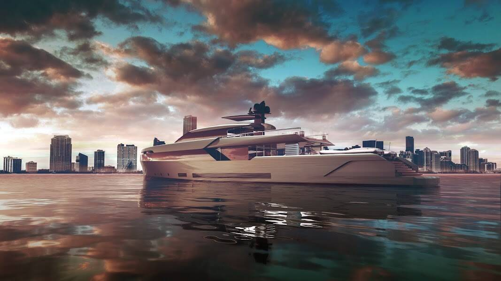

# Cloud Yachts - Bannenberg & Rowell Collection

超级游艇设计师 Bannenberg 和 Rowell 由 Dickie Bannenberg 和创意总监 Simon Rowell 领导，并继承了其中一位最著名的游艇设计师的遗产。超级游艇设计师乔恩·班纳伯格（Jon Bannenberg）——迪基的已故父亲——经常被称为现代游艇设计之父，而迪基和他的团队一直延续着这一传统。Dickie Bannenberg 与他的父亲一起在一系列标志性的超级游艇上工作了 15 年，目前的工作室仍然享有盛誉。Rowell 于 2003 年加入团队，Bannenberg & Rowell 的游艇设计遍布世界各地。

Cloud Yachts - Bannenberg & Rowell 系列 NFT - 常见问题 (FAQ)
▶ 什么是 Cloud Yachts - Bannenberg & Rowell 系列？
Cloud Yachts - Bannenberg & Rowell Collection 是一个 NFT（非同质代币）系列。存储在区块链上的数字艺术品集合。
▶ 有多少 Cloud Yachts - Bannenberg & Rowell Collection 代币？
总共有 6 艘 Cloud Yachts - Bannenberg & Rowell Collection NFT。目前 5 位船主的钱包中至少有一艘 Cloud Yachts - Bannenberg & Rowell Collection NTF。
▶ Cloud Yachts - Bannenberg & Rowell Collection 最近售出了多少？
过去 30 天内售出 0 件 Cloud Yachts - Bannenberg & Rowell Collection NFT。

