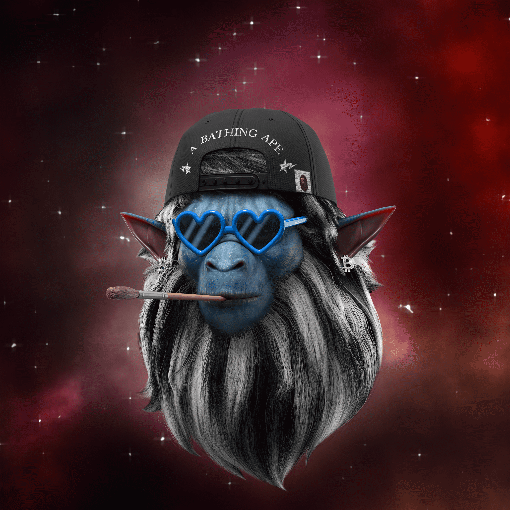

# BAPETAVERSE OFFIClAL

B)APETAVERSE 是 BAPEFAM 聚集在一起的虚拟世界，将收藏品的目的提升到一个新的水平。从官方的 A BATHING APE®️ 概念化，人猿之王将成为 (B)APETAVERSE 的头条新闻，并首次揭开他的面庞。这些独特的高质量 3D 设计的 NFT 将帮助会员解锁未来的独家特权、掉落、抽奖、内容等。

(B)APETAVERSE NFT - 常见问题 (FAQ)
▶ 什么是 (B)APETAVERSE？
(B)APETAVERSE 是一个 NFT (Non-fungible token) 集合。存储在区块链上的数字艺术品集合。
▶ 有多少 (B)APETAVERSE 代币？
总共有 10,000 个 (B)APETAVERSE NFT。目前，4,439 位所有者的钱包中至少有一个 (B)APETAVERSE NTF。
▶ 最昂贵的 (B)APETAVERSE 销售是什么？
出售的最昂贵的 (B)APETAVERSE NFT 是 (B)APETAVERSE #3922。它于 2022 年 6 月 20 日（2 个月前）以 3.3 万美元的价格售出。
▶ 最近卖出了多少 (B)APETAVERSE？
过去 30 天内售出了 169 个 (B)APETAVERSE NFT。
▶ (B)APETAVERSE 的费用是多少？
过去 30 天，最便宜的 (B)APETAVERSE NFT 销售额低于 307 美元，最高销售额超过 816 美元。(B)APETAVERSE NFT 的中位价格在过去 30 天内为 428 美元。
▶ 什么是流行的 (B)APETAVERSE 替代品？
许多拥有 (B)APETAVERSE NFT 的用户还拥有 ZombieClub 代币、 Karafuru x HYPEBEAST x atmos、 MekaVerse和 Edgar Plans 的 Lil' Heroes。

