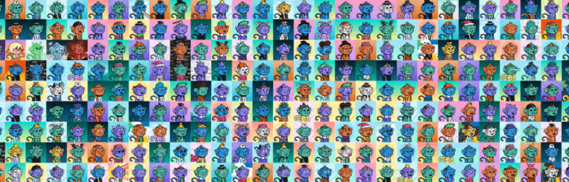

# Bapez Jungle

过去 7 天没有出售 Bapez Jungle。

喔喔喔！啊啊啊啊！

欢迎来到我们致命而甜蜜的巴佩兹丛林！

Bapez Jungle NFT - 常见问题（FAQ）
▶ 什么是巴佩兹丛林？
Bapez Jungle 是一个 NFT（非同质代币）集合。存储在区块链上的数字艺术品集合。
▶ 有多少 Bapez Jungle 代币？
总共有 3,400 个 Bapez Jungle NFT。目前，2,141 位车主的钱包中至少有一个 Bapez Jungle NTF。
▶ 最昂贵的 Bapez Jungle 促销活动是什么？
出售的最昂贵的 Bapez Jungle NFT 是 Bapez Jungle #757。它于 2022-06-10（3 个月前）以 89.8 美元的价格售出。
▶ 最近卖出了多少 Bapez Jungle？
过去 30 天内售出了 96 个 Bapez Jungle NFT。
▶ Bapez 丛林要多少钱？
在过去 30 天里，最便宜的 Bapez Jungle NFT 销售额低于 4 美元，最高销售额超过 26 美元。在过去 30 天内，Bapez Jungle NFT 的中位价格为 8 美元。
▶ 什么是流行的 Bapez Jungle 替代品？
许多拥有 Bapez Jungle NFT 的用户还拥有 Degen Frens Official、 Tales of Akemi和 orctown.wtf。和 真正的火星猴子。

