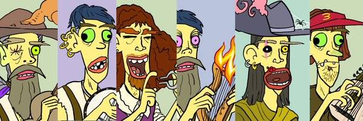

# bardtown.wtf

在英雄之地，有时需要一个真正的失败者来解决问题。与妖精的成功相反，高等精灵的势利，霍比特人的实用性，是所有游戏中最低级的：吟游诗人。欢迎来到 BardTown.WTF，无论您的角色水平或能力如何，您的朋友都不想和您一起玩。免费薄荷，只需支付油费并忍受吟游诗人糟糕的音乐。由不会唱歌的人 Doug TenNapel 绘制，也制作了蚯蚓吉姆。由 Whovie 博士烹制的套装和神秘的 0xth0mas 撰写的合同。因为有比 GoblinTown 更糟糕的东西，我们称那个地方为 BardTown。

bardtown.wtf NFT - 常见问题（FAQ）
▶ 什么是 bardtown.wtf？
bardtown.wtf 是一个 NFT（非同质代币）集合。存储在区块链上的数字艺术品集合。
▶ 存在多少 bardtown.wtf 代币？
总共有 9,969 bardtown.wtf NFT。目前，1,866 位所有者的钱包中至少有一个 bardtown.wtf NTF。
▶ 最昂贵的 bardtown.wtf 销售是什么？
出售的最昂贵的 bardtown.wtf NFT 是 #8772。它于 2022-06-07（3 个月前）以 253.9 美元的价格售出。
▶ 最近卖出了多少 bardtown.wtf？
过去 30 天内售出了 680 个 bardtown.wtf NFT。
▶ bardtown.wtf 需要多少钱？
过去 30 天，最便宜的 bardtown.wtf NFT 销售额低于 2 美元，最高销售额超过 12 美元。bardtown.wtf NFT 在过去 30 天内的中位价格为 4 美元。
▶ 什么是流行的 bardtown.wtf 替代品？
许多拥有 bardtown.wtf NFT 的用户还拥有 Liquid Legends、 Doug TenNapel 的 Eternal Klay、 Typical Tigers和 ApeLiquid。

