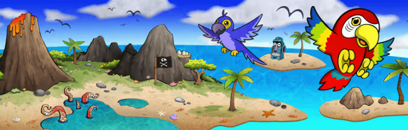

# Barefoot Pandemonium

Yuga IP 组合中明显没有海盗属性。一些突变体有肩鹦鹉，但除此之外，它们与我们品牌最接近的是一些夏威夷衬衫。

我们希望将 Tikimon 建立为去中心化 Ape IP 世界中**的**海盗船长。

接下来，我们在传说中将事物联系在一起，以解释 500 名赤脚海盗是如何从 Tikimon 的魔力中成长起来的。这 500 名海贼都是提基兽的衍生品，在他的身体构成、表情和服装方面都有独特的元素。所有 500 名赤脚海盗还有他们自己的鹦鹉伴侣，与赤脚鹦鹉相匹配，只需稍作调整即可适应 Tikimon 的原始艺术风格。

这些海盗将取代我们的岛屿版税代币，我们希望您对这一举动的兴奋程度与我们一样。 

Barefoot Parrots 和 Pirates 将共同引领我们的知识产权组合走向未来。一部分是我们自己的，一部分是我们参与有史以来最大、最去中心化的商业 IP 实验。

一些赤脚海盗的细节：

- 500 供应上限。
- 所有独特的 1/1 具有属性和稀有性。
- 基于我们的 Tikimon Ape 的衍生产品。
- 不仅是赤脚海盗，还有“猿人 IP 宇宙的海盗”。
- 1 名海盗 = 1 名海盗（不再有等级。较大的遗产持有者将通过接收多个海盗获得奖励）
- 
