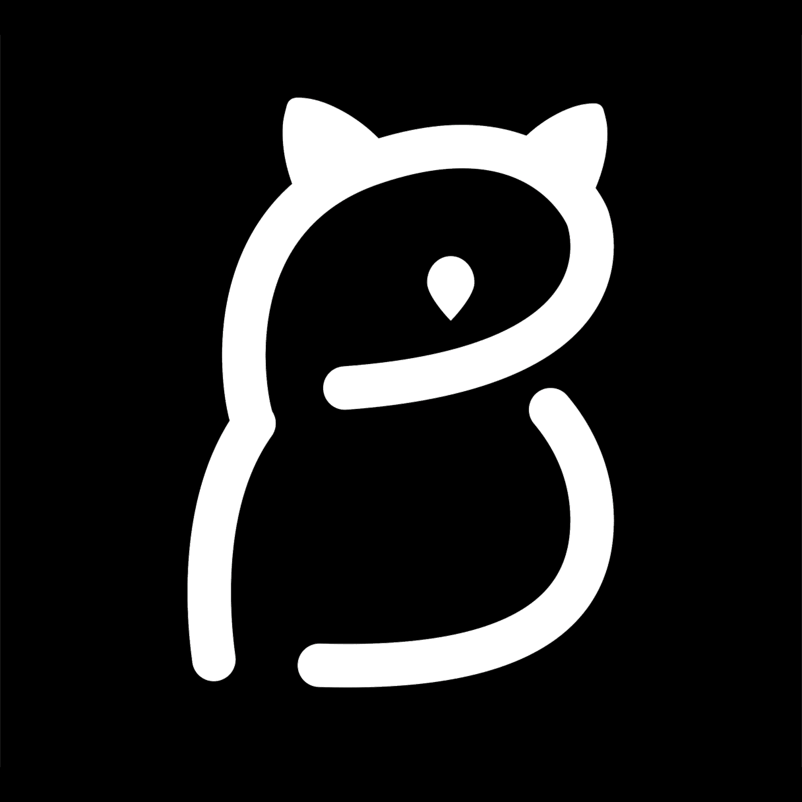

# Barn Owlz

Barn Owlz NFT 在过去 7 天内售出 15 次。Barn Owlz 的总销售额为 910.01 美元。一份 Barn Owlz NFT 的平均价格为 60.7 美元。有 1,239 名 Barn Owlz 所有者，总共拥有 3,000 个代币。

这些猫头鹰太棒了！3,000 只谷仓猫头鹰在以太坊区块链上飞行

Barn Owlz 一直是一个包罗万象的项目，它提供了反映 NFT 社区多样性的各种特征。薄荷的收益已捐赠给野生动物保护协会 (WCS)，帮助他们努力维护野生动物及其美丽的栖息地。Barn Owlz 还与 Land of Hypnos（technoveins，@girlwhoshivers）合作制作了一只外星猫头鹰，所有收益都捐赠给了 St. Jude Children's Hospital。The Barn Owlz 将继续参与慈善捐赠活动，希望在整个 NFT 空间中传播正能量。嗬嗬嗬嗬！

