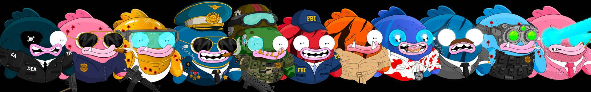

# Based Fish Agents

基于鱼的代理是 1,870 个 NFT 的有限集合！代理只能通过燃烧[基于鱼黑手党的电线](https://opensea.io/collection/based-fish-mafia-wire)来铸造。

关于[卡拉比](https://www.mrcallaby.com/)：

Callaby 在画布上使用亚克力在一个陌生而生动的世界中创造出可爱、胖乎乎的角色。

他的作品经常以他独特的、说明性的风格描绘拟人化的人物。尽管在可爱和令人不安之间摇摆不定。

基于鱼代理 NFT - 常见问题 (FAQ)
▶ 什么是基于鱼类的代理？
Based Fish Agents 是一个 NFT（不可替代代币）集合。存储在区块链上的数字艺术品集合。
▶ 有多少基于鱼类代理的代币？
总共有 956 个基于 Fish Agents 的 NFT。目前，270 位所有者的钱包中至少有一个 Based Fish Agents NTF。
▶ 什么是最昂贵的 Based Fish Agents 销售？
出售的最昂贵的基于鱼类代理的 NFT 是 . 它于 2022-06-19（2 个月前）以 32.9 美元的价格售出。
▶ 最近售出了多少Based Fish Agents？
在过去 30 天内售出了 1 个 Based Fish Agents NFT。

