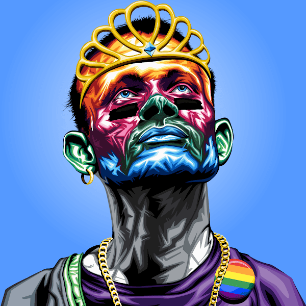

# Based Vitalik Official Collection

BASΞD VITALK 是 4962 个生成 NFT 的集合，与 Vitalik Buterin 本人一样古怪且毫无歉意。BASΞD VITALIK 是对生成 PFP NFT 的超级野兽派，是对加密版税的真正敬意。

基于 VITALK NFT - 常见问题 (FAQ)
▶ 什么是基础维塔利克？
BASED VITALK 是一个 NFT（非同质代币）集合。存储在区块链上的数字艺术品集合。
▶ 有多少个 BASED VITALK 代币？
总共有 4,962 个 BASED VITALK NFT。目前，899 位所有者的钱包中至少有一个 BASED VITALK NTF。
▶ 最昂贵的 BASED VITALK 销售是什么？
销售的最昂贵的 BASED VITALK NFT 是 BASΞD VITALK #2611。它于 2022-06-19（2 个月前）以 9.6 美元的价格售出。
▶ 最近卖出了多少 BASED VITALK？
过去 30 天内售出了 21 个 BASED VITALK NFT。
▶ BASED VITALK 的价格是多少？
在过去 30 天内，最便宜的 BASED VITALK NFT 销售额低于 2 美元，最高销售额超过 8 美元。过去 30 天内，BASED VITALK NFT 的中位价格为 3 美元。
▶ 流行的 BASED VITALK 替代品有哪些？
许多拥有 BASED VITALK NFT 的用户还拥有 MondrianNFT、 Bauhaus Blocks、 Non-Fungible Soup和 R. Mutt。

