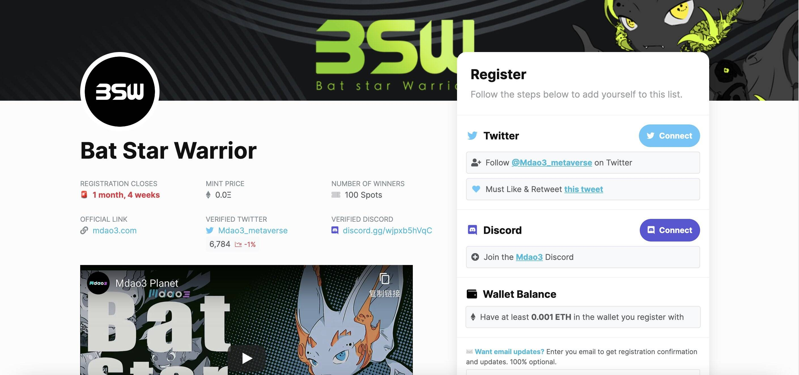

# BSW: Bat Star Warrior Of Mdao3

Bat Star Warrior 是 Mdao3 的第一个 NFT 合集。它将作为整个生态的核心Pass，享受Mdao3最早的创世证明。

我们正在打造一个纯粹的元界星球，你刚才叫我们Mdao3星球。移民将在近期抵达 Mdao3 星球。Mdao3旨在打造一个开放的元界孵化平台，提供模块化组件，帮助元界创业团队简单快速地完成架构设计、合约编写、合约审核、Dapp构建、社区运营、粉丝管理等工作。我们将与您一起建立一个新的元宇宙。

BSW：蝙蝠星勇士 Mdao3 NFT - 常见问题（FAQ）
▶ 什么是 BSW：蝙蝠星勇士 Mdao3？
BSW: Bat Star Warrior Of Mdao3 是一个 NFT (Non-fungible token) 集合。存储在区块链上的数字艺术品集合。
▶ 存在多少 BSW：蝙蝠星勇士 Mdao3 代币？
总共有 1,727 个 BSW：蝙蝠星勇士 Mdao3 NFT。目前，576 位车主的钱包中至少有一个 BSW：蝙蝠星勇士 Mdao3 NTF。
▶ 最贵的 BSW：Mdao3 蝙蝠星勇士特卖会是什么？
最贵的 BSW：蝙蝠星勇士 Mdao3 NFT 售出的是 BSW #216。它于 2022-06-30（大约 2 个月前）以 59.3 美元的价格售出。
▶ BSW：蝙蝠星战士Mdao3最近卖了多少？
过去 30 天内共售出 167 个 BSW：Mdao3 NFT 蝙蝠星战士。
▶ BSW：蝙蝠星勇士 Mdao3 的价格是多少？
过去 30 天，最便宜的 BSW：蝙蝠星勇士 Mdao3 NFT 销售额低于 9 美元，最高销售额超过 16 美元。BSW：Mdao3 NFT 的蝙蝠星战士的中位价格在过去 30 天内为 12 美元。
▶ 什么是流行的 BSW：Mdao3 替代品？
许多拥有 BSW: Bat Star Warrior Of Mdao3 NFTs 的用户也拥有 Chronix Genesis、 trollstown.wtf、 Ops！西班牙苍蝇！和 Chronix 推动者。

