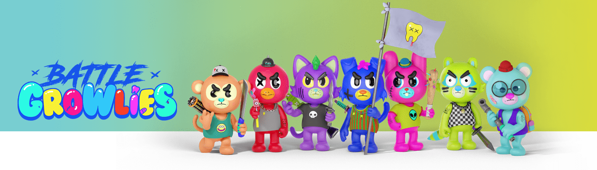

# Battle Growlies Official

由 Onem 和 CreuD 创建的 5,000 个 NFT 的酷炫和新鲜集合。Battle Growlies 是独一无二的 AI 生成系列，其中讲故事和 3D 艺术融合成一个多彩的宇宙。

Battle Growlies 官方 NFT - 常见问题（FAQ）
▶ 什么是战斗咆哮官员？
Battle Growlies Official 是一个 NFT（非同质代币）集合。存储在区块链上的数字艺术品集合。
▶ Battle Growlies 官方代币有多少？
总共有 541 个 Battle Growlies 官方 NFT。目前，115 位车主的钱包中至少有一个 Battle Growlies Official NTF。
▶ 最近卖出了多少Battle Growlies Official？
过去 30 天内共售出 0 个 Battle Growlies 官方 NFT。

