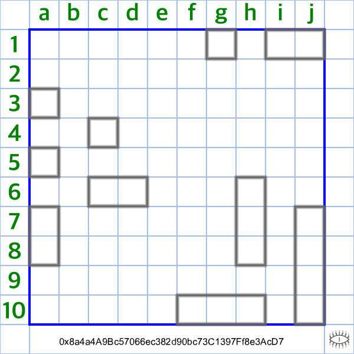

# Battleship Game

战舰游戏统计   创建于 6 个月前   20,000 代币供应  10% 费用没有路线图。

没有不和谐。没有实用性。  我们的下一个项目更有趣。

战舰游戏 NFT - 常见问题（FAQ）
▶ 什么是战舰游戏？
Battleship Game 是一个 NFT（非同质代币）系列。存储在区块链上的数字艺术品集合。
▶ 战舰游戏代币有多少？
总共有 20,000 个 Battleship Game NFT。目前 45 位所有者的钱包中至少有一个 Battleship Game NTF。
▶ 最近卖出了多少战舰游戏？
过去 30 天内共售出 0 个 Battleship Game NFT。

