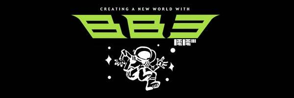

# bb3 explorer badge

bb3 to Planet Earth 你收到了吗？如果您听到此消息，请确保来自地球的著名探险家仅在计划完成后才能收到徽章。绝对不能将探险家徽章交给其他任何人，这一点至关重要。如果您复制，请说“下注”。

bb3 explorer 徽章 NFT - 常见问题（FAQ）
▶ 什么是 bb3 探索者徽章？
bb3 explorer 徽章是一个 NFT（Non-fungible token）集合。存储在区块链上的数字艺术品集合。
▶ 有多少个 bb3 探索者徽章令牌？
总共有 2 个 bb3 探索者徽章 NFT。目前，1,883 位所有者的钱包中至少有一个 bb3 探险家徽章 NTF。
▶ 什么是最昂贵的 bb3 探险家徽章销售？
最昂贵的 bb3 explorer badge NFT 是 bb3 explorer badge [v1.0]。它于 2022-06-29（大约 2 个月前）以 76.4 美元的价格售出。
▶ 最近卖出了多少 bb3 探险家徽章？
过去 30 天内售出了 32 个 bb3 探索者徽章 NFT。
▶ 一个 bb3 探索者徽章要多少钱？
过去 30 天，最便宜的 bb3 探险家徽章 NFT 销售额低于 15 美元，最高销售额超过 35 美元。过去 30 天 bb3 探索者徽章 NFT 的中位价格为 27 美元。
▶ 什么是流行的 bb3 探索者徽章替代品？
许多拥有 bb3 explorer 徽章 NFT 的用户还拥有 Sports Things、 Elysian Fields、 ODDX和 ALL STARS: Trading Card Game。

