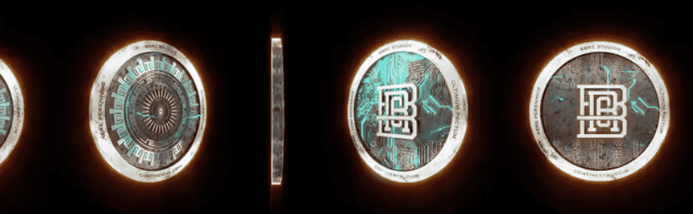

# CONTINENTAL COIN

用黄金铸造的 BBRC Continental Coin 是信任、荣誉和尊重的物理代表。它们代表了确保商品和服务交换的社会契约。深深植根于严格密码的承诺，这些硬币是您的归属证明，拥有它们可以让您普遍访问 BBRC 宇宙。明智地使用它们，或者在未来实用程序展开时坚持使用它们。

BBRC - 大陆币 NFT - 常见问题 (FAQ)
▶ 什么是 BBRC - 大陆硬币？
BBRC - CONTINENTAL COIN 是一个 NFT（非同质代币）集合。存储在区块链上的数字艺术品集合。
▶ 存在多少个 BBRC - CONTINENTAL COIN 代币？
总共有 1 个 BBRC - CONTINENTAL COIN NFT。目前，2,740 位所有者的钱包中至少有一个 BBRC - CONTINENTAL COIN NTF。
▶ 什么是最昂贵的 BBRC - CONTINENTAL COIN 销售？
最昂贵的 BBRC-CONTINENTAL COIN NFT 是 BBRC CONTINENTAL COIN。它于 2022-06-28（大约 2 个月前）以 247 美元的价格售出。
▶ 最近卖出了多少 BBRC - CONTINENTAL COIN？
过去 30 天内售出了 84 个 BBRC - CONTINENTAL COIN NFT。
▶ 一枚 BBRC - 大陆硬币的价格是多少？
在过去 30 天里，最便宜的 BBRC - CONTINENTAL COIN NFT 销售额低于 13 美元，最高销售额超过 97 美元。过去 30 天 BBRC - CONTINENTAL COIN NFT 的中位价格为 33 美元。

