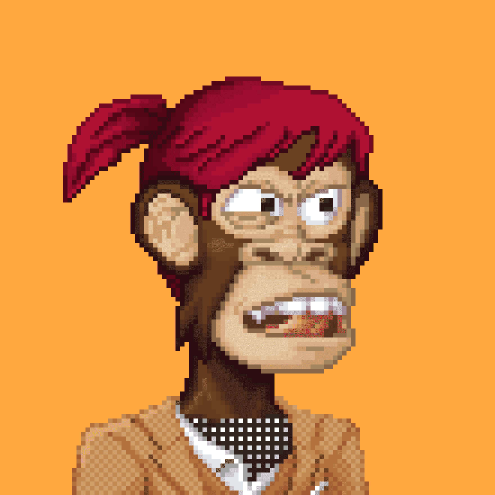

# BBYC Bored Bits Yacht Club

厌倦了他们的外表，世界上最著名的类人猿决定将自己投入到像素化机器中，结果是收集了 10,000 个免费的惊人而独特的像素艺术。

MUTANT BITS YACHT CLUB 是多达 20,000 个 Mutant Bits 的集合，只能通过将现有的 Bored Bits 暴露于一瓶 MUTANT SERUM 或通过在公开发售中铸造 Mutant Bits 来创建。

MBYC 是一种用全新的 NFT（他们的猿的“突变”版本）奖励我们的猿持有者的一种方式，同时还允许新人以较低级别的成员身份进入 BBYC 生态系统。突变体代表最后一级成员；未来的一切都是为了给无聊的猿人增加效用和会员独有的好处，但也包括突变体。

