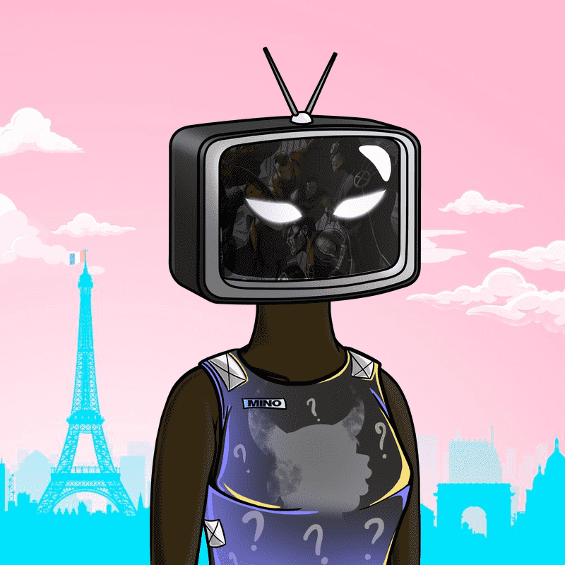

# BroadcastersNFT

广播公司是以太坊区块链上以编程方式随机生成的 NFT 的集合。第一代由 300 多个特征随机组合而成的 7,777 种艺术组成。广播员有各种服装、屏幕和颜色。每个主播都由独特的身体、头部、屏幕、服装和配饰组成。欢迎加入广播公司 NFT 大家庭。

解开以太坊区块链上最古老的 NFT 生成集合。广播员不仅是完美的头像，还可以让您获得独家社区福利。您的广播员是参加为该项目计划的所有比赛和抽奖活动的门票，让您有机会赢得 BIG。时间在流逝，你和我们在一起吗？

广播公司是以太坊区块链上以编程方式随机生成的 NFT 的集合。第一代由 300 多个特征随机组合而成的 7,777 种艺术组成。广播员有各种服装、屏幕和颜色。每个主播都由独特的身体、头部、屏幕、服装和配饰组成。

