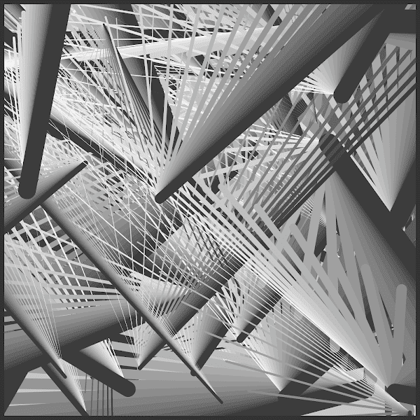

# BEAMS NFT

梁。创建的生成 NFT 类似于光的反射和折射。现象系列的第 2 部分

欢迎来到我的页面，我从 2021 年 1 月开始从事 NFT 领域，当时我与人共同创立了 Pixa NFT，这是一个源自流行的[PixaWizards](https://opensea.io/collection/pixawizards) pfp NFT 集合的元界项目。我创建了“现象系列”，这是一系列极简主义的生成艺术 NFT 系列，以创造性的抽象风格突出物理现象。我还主持了 Metaverse Meetup，这是一个供小型艺术家在 Cryptovoxels metaverse 中展示他们的作品并在流式传输到多个社交媒体平台的采访中讨论他们的作品的平台。

BEAMS NFT NFT - 常见问题（FAQ）
▶ 什么是 BEAMS NFT？
BEAMS NFT 是一个 NFT（不可替代代币）集合。存储在区块链上的数字艺术品集合。
▶ 存在多少 BEAMS NFT 代币？
总共有 162 个 BEAMS NFT NFT。目前 76 位所有者的钱包中至少有一个 BEAMS NFT NTF。
▶ 最近卖出了多少 BEAMS NFT？
过去 30 天内售出 0 个 BEAMS NFT NFT。

