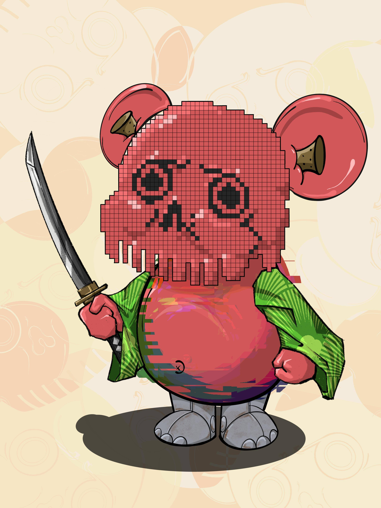

# Bearache

您在元界的第一个数字朋友！Bearache 是 10,000 种独特生物的集合？宠物？3D游戏化版本即将在KOOOLA City诞生。

Bearache NFT - 常见问题（FAQ）
▶ 什么是胡子？
Bearache 是一个 NFT（不可替代代币）集合。存储在区块链上的数字艺术品集合。
▶ 有多少 Bearache 代币？
总共有 958 个 Bearache NFT。目前，314 位所有者的钱包中至少有一个 Bearache NTF。
▶ 最近卖出了几只 Bearache？
过去 30 天内售出 0 个 Bearache NFT。
▶ 什么是流行的 Bearache 替代品？
许多拥有 Bearache NFT 的用户还拥有 CUBEING， 由 Val Kilmer X Remo、 SpacePirateBottles和 VoxoDeus 提供。

