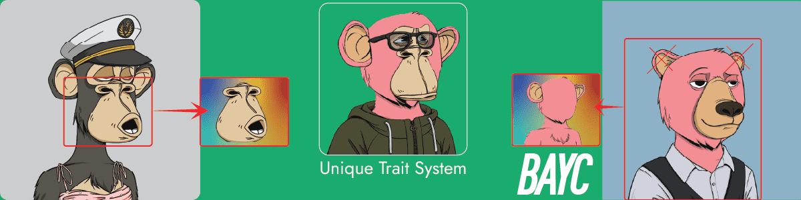

# bear ape yacht club

熊猿 熊猿 熊猿 熊猿 熊猿 熊猿

熊猿游艇俱乐部 NFT - 常见问题（FAQ）
▶ 什么是熊猿游艇俱乐部？
熊猿游艇俱乐部是一个 NFT（Non-fungible token）集合。存储在区块链上的数字艺术品集合。
▶ 熊猿游艇俱乐部代币有多少？
总共有 1,460 个熊猿游艇俱乐部 NFT。目前，158 位船东的钱包里至少有一个熊猿游艇俱乐部 NTF。
▶ 最近卖了多少熊猿游艇会？
过去 30 天内售出 0 个熊猿游艇俱乐部 NFT。
▶ 什么是流行的熊猿游艇俱乐部替代品？
许多拥有熊猿游艇俱乐部 NFT 的用户还拥有 NotOkayMiladys、 OkayApeTown.wtf、 notBasquiart和 Okay Bull Bears。

