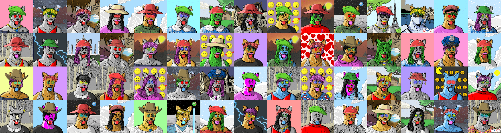

# Bear-Necessities Sanctuary

嗨，我是**熊**。我是盲人，但不要惊慌，一切都很好。我不需要眼睛来*“看”*这个世界。 熊必需品保护区 是为拯救像我这样的现实生活中的动物而创建的！！！每次您购买 BEAR NFT，您也可以挽救生命！部分收益用于凤凰动物护理和治疗（PACT）

Bear NFT 是 10 000 个独特的 Bear NFT 的集合，是生活在以太坊区块链上的数字收藏品。算法生成的集合由 9 种不同的 Traits 产生，包含 350 多种数字手绘配饰、服装、背景等，其中包含 50 个无随机化的定制 NFT。

